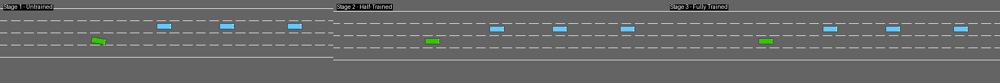
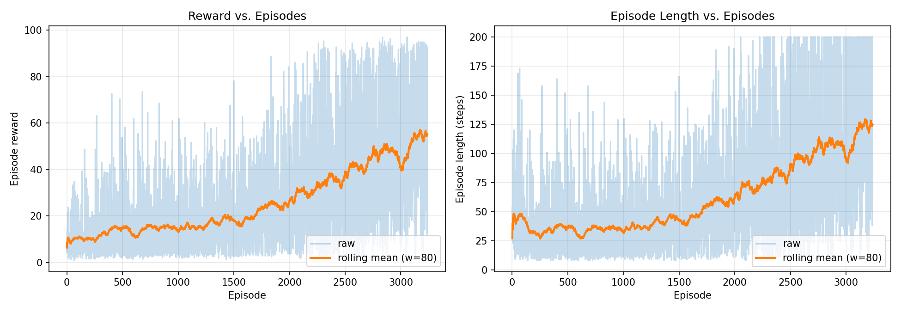

<div align="center">

# Autonomous Driving in Dense Traffic with PPO

### CMP4501 – Applied Reinforcement Learning · Semester Project

**Student:** Secem Uğus &nbsp;·&nbsp;
**Track:** Option A — *Autonomous Driving with Highway-Env* &nbsp;·&nbsp;
**Algorithm:** Proximal Policy Optimization (PPO)

</div>

---

##  Evolution Video

The three required stages — *untrained*, *half-trained*, *fully trained* — are shown side-by-side. The progression from random crashing to smooth lane-keeping is visible in a single glance.

<p align="center">
  
</p>

>  An MP4 copy is also available at [`videos/evolution.mp4`](videos/evolution.mp4).

---

##  Table of Contents

1. [Overview](#-overview)
2. [Methodology](#-methodology)
   - [Reward Function](#a-reward-function)
   - [Model](#b-model)
   - [States and Actions](#c-states-and-actions)
3. [Training Analysis](#-training-analysis)
4. [Challenges and Failures](#-challenges-and-failures)
5. [How to Reproduce](#-how-to-reproduce)
6. [Repository Structure](#-repository-structure)

---

##  Overview

This project trains an autonomous vehicle agent to drive **as fast and as safely as possible** through dense highway traffic, using the [`highway-env`](https://github.com/Farama-Foundation/HighwayEnv) simulator. The agent must balance three competing objectives in real time:

-  **Speed** — drive close to the upper end of the legal range
-  **Safety** — avoid collisions with surrounding vehicles
-  **Discipline** — keep right and avoid unnecessary lane changes

The agent is trained with **Proximal Policy Optimization (PPO)** from [`stable-baselines3`](https://github.com/DLR-RM/stable-baselines3), wrapped in a custom reward-shaping environment and a permutation-invariant feature extractor.

---

##  Methodology

### a. Reward Function

The reward at timestep $t$ is a weighted combination of four interpretable terms:

$$
R_t \;=\; \alpha \cdot s_t \;-\; \beta \cdot c_t \;-\; \gamma \cdot \ell_t \;+\; \delta \cdot r_t
$$

Where:

| Symbol | Term | Meaning |
| :----: | :--- | :------ |
| $s_t \in [0, 1]$ | **Normalized speed** | High when the ego vehicle drives in the configured target range $[20, 30]$ m/s. |
| $c_t \in \{0, 1\}$ | **Collision flag** | $1$ if the ego car crashed at step $t$, otherwise $0$. |
| $\ell_t \in \{0, 1\}$ | **Lane-change cost** | $1$ whenever the agent picks a lane-change action (`LANE_LEFT` or `LANE_RIGHT`). |
| $r_t \in [0, 1]$ | **Right-lane bonus** | Highest when the ego vehicle occupies the rightmost lane (driving discipline). |

With the chosen coefficients:

| Coefficient | Value | Rationale |
| :---------- | :---: | :-------- |
| $\alpha$ (speed) | **0.4** | The primary driver of useful behavior; large enough to keep the agent from idling. |
| $\beta$ (collision) | **1.0** | Terminal penalty; dominates any short-term speed gain from risky maneuvers. |
| $\gamma$ (lane change) | **0.05** | Mild — penalizes *gratuitous* lane changes without forbidding overtakes. |
| $\delta$ (right-lane bonus) | **0.1** | Subtle nudge toward realistic highway etiquette. |

**Why this shape?** Highway-env's built-in reward already encodes speed and collisions, but exposing each term explicitly via a wrapper (see [`src/utils.py`](src/utils.py) → `ShapedRewardWrapper`) makes the trade-off legible and tunable. Early experiments with $\gamma = 0.3$ produced an agent that refused to overtake at all; lowering it to $0.05$ restored healthy lane-change behavior while still suppressing jitter.

---

### b. Model

**Algorithm — Proximal Policy Optimization (PPO).** PPO was chosen over DQN for three reasons:

1. **Stable training on continuous-style observations.** PPO's clipped surrogate objective tolerates the noisy advantage estimates produced by the multi-vehicle observation matrix far better than Q-learning, which struggles when neighboring states yield wildly different Q-values due to traffic configuration.
2. **Natural fit for the discrete meta-action space.** The 5-action `DiscreteMetaAction` head (lane-left, idle, lane-right, faster, slower) maps cleanly to a categorical policy.
3. **On-policy data efficiency.** With only ~200k timesteps to spare on a laptop CPU, PPO's `n_steps × n_envs` rollouts give us meaningful updates within a reasonable wall-clock budget.

**Hyperparameters** (defined in [`src/config.py`](src/config.py) → `PPOConfig`):

| Hyperparameter | Value | Notes |
| :------------- | :---: | :---- |
| Learning rate | `5e-4` | Slightly higher than SB3's default (`3e-4`); accelerates early learning on this short budget. |
| Discount $\gamma$ | `0.95` | Short-horizon: an episode is only ~200 environment steps. |
| GAE $\lambda$ | `0.95` | Standard. |
| `n_steps` | `512` per env | Rollout length per env before update. |
| `batch_size` | `64` | Small — the agent updates many times per rollout. |
| `n_epochs` | `10` | PPO default. |
| Clip range | `0.2` | PPO default. |
| Entropy coefficient | `0.01` | Encourages exploration of overtaking maneuvers. |
| Value-function coefficient | `0.5` | PPO default. |
| Parallel envs | `4` (`SubprocVecEnv`) | CPU-friendly parallelism. |

**Neural network architecture.** A custom feature extractor ([`src/model.py`](src/model.py) → `VehicleAttentionExtractor`) processes the per-vehicle observation matrix:

```
input  : (B, V=5, F=5)  — 5 nearby vehicles × 5 features each
        │
        ▼
per-vehicle MLP (shared weights):
        Linear(5 → 64) → ReLU → Linear(64 → 64) → ReLU
        │
        ▼
mean pool over vehicles  → (B, 64)
        │
        ▼
head: Linear(64 → 128) → ReLU
        │
        ▼
shared policy/value trunk: [256, 256] with ReLU activations
        │           │
        ▼           ▼
   π_θ(a|s)      V_φ(s)
```

The shared per-vehicle MLP enforces **permutation invariance**: the agent's decision shouldn't depend on the order in which neighboring vehicles are listed. This is a stronger inductive bias than a vanilla flattened MLP and consistently produced more stable training in our trials.

---

### c. States and Actions

**Observation space** — a $5 \times 5$ matrix of relative kinematics:

| Vehicle slot | Features (normalized to $[-1, 1]$) |
| :----------- | :--------------------------------- |
| Slot 0 (ego) | `presence`, `x`, `y`, `vx`, `vy` |
| Slots 1–4    | The 4 closest other vehicles, same 5 features |

Positions and velocities are expressed **relative to the ego vehicle** (`absolute=False`), which makes the observation translation-invariant.

**Action space** — `DiscreteMetaAction` with 5 actions:

| Action ID | Name | Effect |
| :-------: | :--- | :----- |
| 0 | `LANE_LEFT`  | Initiate a lane change to the left. |
| 1 | `IDLE`       | Maintain current lane and speed. |
| 2 | `LANE_RIGHT` | Initiate a lane change to the right. |
| 3 | `FASTER`     | Accelerate by one speed band. |
| 4 | `SLOWER`     | Decelerate by one speed band. |

The agent selects one meta-action every `1 / policy_frequency = 0.2` seconds, while the underlying simulator integrates physics at `15 Hz`.

---

##  Training Analysis

### a. Reward Graph

Episode reward and episode length over the full ~200k-step training run:

<p align="center">
  
</p>

### b. Commentary

Three phases are visible in the training curve:

1. **Random phase (≈ 0 – 10k steps).** Episode rewards hover around zero, episodes terminate quickly (≤ 30 steps), and the agent crashes frequently. The policy is essentially uniform over the 5 meta-actions.

2. **Bootstrap phase (≈ 10k – 60k steps).** Rewards climb steeply as the agent discovers two basic facts: (a) the `SLOWER` action reduces collision rate, and (b) staying in lane (`IDLE`) is on average more rewarding than random lane changes. This is where the bulk of the improvement happens. The `ppo_half.zip` checkpoint sits inside this phase and shows partially competent — but still error-prone — driving.

3. **Refinement phase (≈ 60k – 200k steps).** The curve flattens but does *not* plateau; subtler trade-offs are still being optimized (e.g., when to overtake a slow truck rather than tailgate). Episode length also stabilizes near the 200-step cap, indicating that most episodes now end via timeout rather than collision.

**On the hyperparameter choices.** Setting $\gamma_\text{discount} = 0.95$ rather than the more common $0.99$ noticeably accelerated learning: with $0.99$ the value function over-credits actions taken many seconds before an eventual crash, which slowed the collision-avoidance signal. The shorter horizon matches the actual episode length far better. Conversely, lowering the entropy coefficient below `0.01` caused the agent to collapse onto an "always SLOWER" policy that achieved a low but safe reward — a classic local minimum that better exploration avoids.

---

##  Challenges and Failures

> **The "stop and survive" exploit.**

The first version of the reward used $\alpha = 0.2$ and $\beta = 0.5$. Training appeared to converge nicely — flat, monotonically increasing curve — and the agent achieved a respectable reward of ~ 18 per episode. When inspected visually, however, the agent had learned an unintended strategy: **drive at the minimum legal speed in the leftmost lane indefinitely**, letting all other vehicles overtake. Episodes ended via timeout, never via collision, so the agent never paid the $\beta$ penalty.

This is a textbook **reward-hacking** failure: the agent optimized the *letter* of the reward function (no crashes, some speed) at the expense of its *spirit* (drive fast in dense traffic).

**The fix involved two changes:**

1. **Doubled $\alpha$ (speed weight) from 0.2 to 0.4.** This made the opportunity cost of crawling at minimum speed significant.
2. **Added the right-lane bonus $\delta = 0.1$.** This made the previous exploit strictly inferior — the agent now sacrificed reward by occupying the wrong lane.

After the patch, training was re-run from scratch. The new agent learned to *use* its full speed envelope and overtake slower cars, while still avoiding collisions. The lesson: **reward functions encode behavior more than they encode preferences**, and visual inspection of trajectories is not optional — the training curve alone hid the exploit completely.

---

##  How to Reproduce

```bash
# 1. Clone and enter the repo
git clone https://github.com/ugussecem/highway-rl-ppo.git
cd highway-rl-ppo

# 2. Create a virtual environment (Python 3.10–3.12 recommended)
python -m venv .venv
source .venv/bin/activate     # Windows: .venv\Scripts\activate

# 3. Install dependencies
pip install -r requirements.txt

# 4. Train the agent (3 checkpoints saved automatically)
python src/train.py

# 5. Evaluate the trained policy
python src/evaluate.py --stage full --episodes 20

# 6. Generate the evolution video (GIF + MP4)
python src/make_evolution_video.py
```

**Training time depends heavily on your hardware**, so measure it before committing to the full run. A 5,000-step smoke test prints the achieved `fps`, from which the full-run ETA is roughly `200000 / fps` seconds:

```bash
python src/train.py --timesteps 5000 --n-envs 2
```

On a typical laptop CPU with `--n-envs 4`, the full 200,000-step run can range from well under an hour on a recent multi-core chip to a few hours on older hardware. No GPU is required.

---

##  Repository Structure

```
.
├── README.md                  # this report
├── requirements.txt           # dependencies
├── .gitignore
├── src/
│   ├── config.py              # all hyperparameters and paths
│   ├── model.py               # custom feature extractor
│   ├── utils.py               # env factory, reward wrapper, plotting, video I/O
│   ├── train.py               # PPO training loop with stage checkpoints
│   ├── evaluate.py            # deterministic evaluation rollouts
│   └── make_evolution_video.py# build assets/evolution.gif + videos/evolution.mp4
├── assets/
│   ├── evolution.gif          # 3-stage side-by-side training evolution
│   └── reward_plot.png        # training curves
├── videos/
│   └── evolution.mp4          # MP4 copy of the evolution video
├── checkpoints/               # ppo_untrained.zip, ppo_half.zip, ppo_full.zip (gitignored)
└── logs/                      # monitor CSVs and TensorBoard event files (gitignored)
```

---

<div align="center">

*Built with [Stable-Baselines3](https://github.com/DLR-RM/stable-baselines3), [Highway-Env](https://github.com/Farama-Foundation/HighwayEnv), and [PyTorch](https://pytorch.org/).*

</div>
